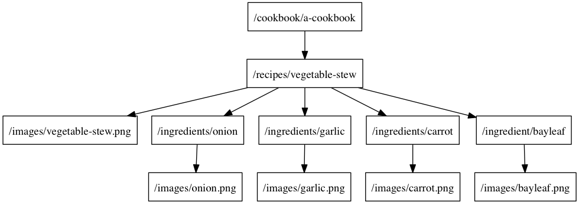

[](https://travis-ci.org/dstnbrkr/DRBOperationTree)

# DRBOperationTree
DRBOperationTree is an iOS and OSX API to organize work (NSOperations) into a tree such that the output of each parent is passed to it's children for further processing.

# Quick Start
If you want to get right into the details, take a look at the Example project. In particular:
* [DRBOperationTree configuration](https://github.com/dstnbrkr/DRBOperationTree/blob/0.0.1/Example/Example/DRBAppDelegate.m#L57-L78)
* [DRBOperationProvider implementation](https://github.com/dstnbrkr/DRBOperationTree/blob/0.0.1/Example/Example/DRBRecipeProvider.m)

More in-depth explanation of these topics and the motivation below.

# Example
Let's say we have an API with the following endpoints:

<table>
  <tr>
    <td>/cookbook/{cookbook_id}</td>
    <td>provides a list of recipe ids</td>
  </tr>
  <tr>
    <td>/recipes/{recipe_id}</td>
    <td>provides JSON representation of recipe</td>
  </tr>
  <tr>
    <td>/ingredients/{ingredient_id}</td>
    <td>provides JSON representation for an ingredient</td>
  </tr>
  <tr>
    <td>/images/{image_id}</td>
    <td>provides PNG image</td>
  </tr>
</table>

In order to serialize the object graph for a cookbook, we'd need to fetch the list of recipe ids from the `/cookbook/{cookbook_id}` endpoint, then fetch each recipe, followed by each image and each ingredient for each recipe. What we request at each step depends on the response of the request in the previous step. For example, to know which (and how many) `/ingredients/{ingredient_id}` requests we'll make, we have to first fetch and parse `/recipes/{recipe_id}/ingredient`. We can model these dependencies as a tree.

If were to serialize the object graph for a vegetable stew recipe, the tree of requests we'd make would be something like this:



Now let's use this API to make an iOS app which will display all the recipes in a cookbook. For this example, the main view is a list of recipes with an image and an abbreviated list of their ingredients. To display a recipe, we'll need to serialize a recipe and all it's child objects. We don't want to keep the user waiting until we're done with all the requests we need to make, so let's show the user recipes as soon as they're ready. This means we're going to traverse that request tree in level order, making requests in parallel wherever we can. We could try an approach like:

```objective-c
[self fetchCookbook:cookbookID completion:^(id cookbook) {
    for (id recipeID in cookbook.recipeIDs) {
        [self fetchRecipe:recipeID completion:^{id recipe) {
            for (id ingredientID in recipe.ingredientIDs) {
                [self fetchIngredient:ingredientID completion:^(id ingredient) {
                    for (id imageID in ingredient.imageIDs) {
                        [recipe addIngredient:ingredient];

                        [self fetchImage:imageID completion:^(id image) {
                            [ingredient addImage:image];
                        }];
                    }
                    [recipe addIngredient:ingredient];
                }];
            }
        }];
        
        for (id imageID in recipe.images) {
            [self fetchImage:imageID completion:^(id image) {
                [recipe addImage:image];
            }];
        }
    }
}];
```

Assuming all our fetch methods allow concurrent requests, this will achieve our goal but the code is less than ideal. We could clean up the code, but there's another problem to solve: we need to know when all the child objects are serialized. In our request tree above, we have two sets of leaf nodes: recipe images and ingredient images. In the approach above, we'd need to add code to detect when both sets of asynchronous requests are complete.

An alternate approach would take into account that all the code above follows a pattern of:
* map an object to one or more child objects (i.e. cookbook -> recipes, recipe -> ingredients)
* enqueue some work for each child object

DRBOperationTree takes exactly that approach. DRBOperationTree lets us define dependencies as a tree, then it performs the 'work' each node corresponds to in level order. A node is marked completed once the post-order traversal below it has completed. Here's how the code above could be refactored to use DRBOperationTree:

```objective-c
DRBOperationTree *cookbook = [DRBOperationTree tree];
DRBOperationTree *recipe = [DRBOperationTree tree];
DRBOperationTree *recipeImage = [DRBOperationTree tree];
DRBOperationTree *ingredient = [DRBOperationTree tree];
DRBOperationTree *ingredientImage = [DRBOperationTree tree];

recipe.provider = [[RecipeProvider alloc] init];
recipeImage.provider = [[RecipeImageProvider alloc] init];
ingredient.provider = [[IngredientProvider alloc] init];
ingredientImage.provider = [[IngredientImageProvider alloc] init];

[cookbook addChild:recipe];
[recipe addChild:recipeImage];
[recipe addChild:ingredient];
[ingredient addChild:ingredientImage];

[cookbook sendObject:@"a-cookbook" completion:^{
  // all done
}];
````

Each node in the tree sends it's output to it's children. In this example, the recipe node sends serialized recipe objects to the ingredient nodes. The ingredient.provider is responsible for mapping the incoming recipe object to outgoing ingredient objects. Then it creates NSOperations which will download and serialize each ingredient object. The provider object confirms to the DRBOperationProvider protocol, which has these two methods:

```objective-c

// maps input objects to output objects (ex. recipe -> ingredient ids) 
- (void)operationTree:(DRBOperationTree *)node
     objectsForObject:(id)object
           completion:(void(^)(NSArray *objects))completion {

    // this method is optionally asynchronous
    // in this example, we're just mapping a recipe to it's child ingredient ids
    completion(recipe.ingredientIDs);
}

// given an object, returns an operation for that object and passes along the result
// (ex. ingredient id -> operation to fetch ingredient -> serialized ingredient object)
- (NSOperation *)operationTree:(DRBOperationTree *)node
            operationForObject:(id)object
                  continuation:(void(^)(id, void(^)()))continuation
                       failure:(void(^)())failure;

    return [NSBlockOperation blockOperationWithBlock:^{
        [self fetchIngredient:object completion:success];
    }];
}
```

Using this approach with DRBOperationTree, we've:
* solved our initial problem of serializing the graph in parallel to make the best user experience
* found a way to detect when the full serialization is complete (i.e. when the post-order traversal of the tree is complete)
* refactored the outer code into a structure that corresponds to our request tree
* refactored the inner code into specialized objects that correspond to each step in our serialization

# Maintainer

* [Dustin Barker @dstnbrkr](http://twitter.com/dstnbrkr)

# License

DRBOperation is available under the MIT license. See the LICENSE file for more info.


